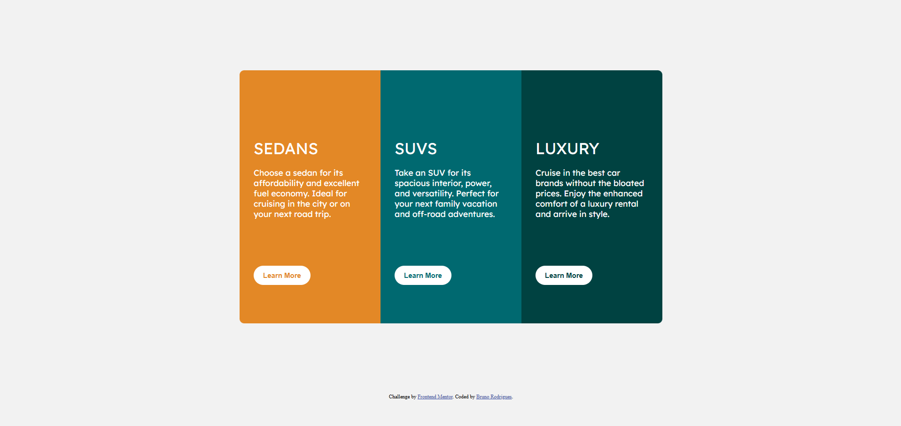

# Frontend Mentor - Solução do componente de cartão de visualização em 3 colunas

Esta é uma solução para o [desafio do componente de cartão de visualização em 3 colunas no Frontend Mentor](https://www.frontendmentor.io/challenges/3column-preview-card-component-pH92eAR2-). Os desafios do Frontend Mentor ajudam você a melhorar suas habilidades de codificação, construindo projetos realistas.

## Visão Geral

### O desafio

Os usuários devem ser capazes de:

- Visualizar o layout ideal dependendo do tamanho da tela do dispositivo
- Ver os estados de hover para elementos interativos
- Responsividade para smartphone

### Captura de tela



### Links

- URL da solução: [Repositório](https://github.com/bruninhosrs/Card-Component)
- URL do site ao vivo: [Deploy no Vercel](https://card-component-olive.vercel.app/)

## Meu processo

### Tecnologias usadas

- Marcação semântica HTML5
- Propriedades personalizadas CSS
- Flexbox

### O que aprendi

Aprendi e compreendi a usar mais o `display: flex`, e arredondamento nas bordas, mas nas extremidades, e estilização nos botões.
Para ver como você pode adicionar trechos de código, veja abaixo:

```css
#sedans {
  background-color: #e38826;
  border-top-left-radius: 10px;
  border-end-start-radius: 10px;
}

#luxury {
  background-color: #004241;
  border-top-right-radius: 10px;
  border-end-end-radius: 10px;
}
```

### Desenvolvimento contínuo

Ainda está um pouco confuso sobre como arrendondar apenas algumas bordas e não todas, mas seria mais sobre as propriedades.

### Recursos úteis

- [Exemplo de recurso 1](https://www.example.com) - Isso me ajudou por XYZ razão. Eu realmente gostei desse padrão e o usarei daqui para frente.
- [Exemplo de recurso 2](https://www.example.com) - Este é um artigo incrível que me ajudou a finalmente entender XYZ. Eu recomendaria para qualquer pessoa que ainda esteja aprendendo esse conceito.

## Autor

Me siga nas minhas redes sociais

- LinkedIn - [Bruno Rodrigues](www.linkedin.com/in/rodrigues-silva-bruno)
- Frontend Mentor - [@bruninhosrs](https://www.frontendmentor.io/profile/bruninhosrs)
- GitHub - [@bruninhosrs](https://github.com/bruninhosrs)

**Nota: Apague esta nota e adicione/remova/edite as linhas acima conforme os links que você gostaria de compartilhar.**

## Agradecimentos

Obrigado por visualizar e gostaria de feedback neste projeto.

Agradeço desde já!
